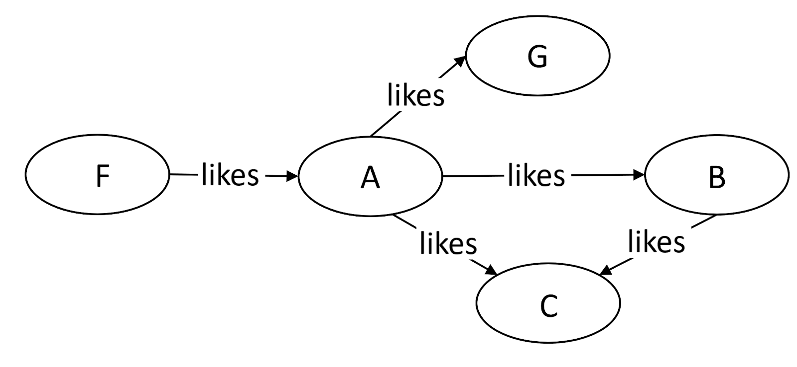
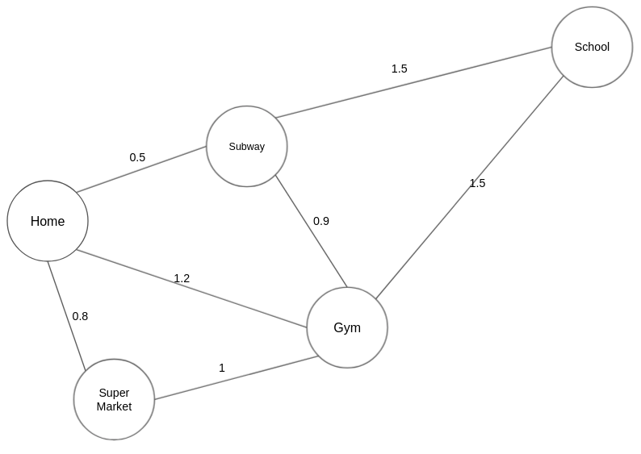

# Problem Solving In My Room

### This Repo Related to Problem Solving Challenges And Learning Study Cases

# Table of contents

<!--ts-->

- [Hash Table](#hash-table)
- [Binary Tree](#binary-tree)
- [Graphs](#graphs)
- [Linked List](#linked-list)
- [Daily Challenge](#daily-challenge)
<!--te-->

# Hash Table

https://leetcode.com/explore/learn/card/hash-table/182/practical-applications/

### The Principle of Built-in Hash Table

The typical design of built-in hash table is:

- The key value can be any hashable type. And a value which belongs to a hashable type will have a hashcode. This code will be used in the mapping function to get the bucket index.
- Each bucket contains an array to store all the values in the same bucket initially.
  If there are too many values in the same bucket, these values will be maintained in a height-balanced binary search tree instead.
- The average time complexity of both insertion and search is still O(1). And the time complexity in the worst case is O(logN) for both insertion and search by using height-balanced BST. It is a trade-off between insertion and search.

#### Isomorphic String Solution Explaination

we need to cover some criteria like

- We can map a character only to itself or to one other character.
- No two character should map to same character.
- Replacing each character in string s with the character it is mapped to results in string t.

### Usage

- Used to Store Key/Value Pairs
- Provide more information Like (Two Sum Problems)
- aggregate all the information by key

### Design Key

Sometimes you have to Think it over to **Design Suitable Key** When Using Hahs Table Given Array
of Strings, Group Anagram so at this case it's Better to Sort the Key Before add it to The Hash Table

- All Values Belong to The Same Group Will Be Mapped in the Same Group
- Values Which Needed to be Separated into Different Groups Will Not Be Mapped into the Same Group
  Examples:
- Group Anagram
- Valid Sudoku
- Find Duplicate at Sub Tree (Very Important Example of How you Must Think about Design Hash Table Key)

### Practical Examplea

##### Contains Duplicat

https://leetcode.com/explore/learn/card/hash-table/183/combination-with-other-algorithms/1112/

```javascript
var containsDuplicate = function (nums) {
  const set = new Set();
  for (const num of nums) {
    if (set.has(num)) return true;
    set.add(num);
  }
  return false;
};
```

##### Single Number

https://leetcode.com/explore/learn/card/hash-table/183/combination-with-other-algorithms/1176/

```javascript
var singleNumber = function (nums) {
  const map = new Map();
  for (const num of nums) map.has(num) ? map.set(num, map.get(num) + 1) : map.set(num, 1);

  for (const [key, value] of map) if (value === 1) return key;
};
```

##### Intersection of Two Arrays

https://leetcode.com/explore/learn/card/hash-table/183/combination-with-other-algorithms/1105/

```javascript
var intersection = function (nums1, nums2) {
  const set1 = new Set();
  const set2 = new Set();
  for (const num of nums1) set1.add(num);
  for (const num of nums2) set2.add(num);
  return set1.size > set2.size ? findIntersection(set1, set2) : findIntersection(set2, set1);
};

const findIntersection = (set1, set2) => {
  const result = [];
  for (const val of set1) if (set2.has(val)) result.push(val);
  return result;
};
```

##### Happy Number

https://leetcode.com/explore/learn/card/hash-table/183/combination-with-other-algorithms/1131/

```javascript
function isHappy(num) {
  var m, n;
  var c = [];

  while (num != 1 && c[num] !== true) {
    c[num] = true;
    m = 0;
    while (num > 0) {
      n = num % 10;
      m += n * n;
      num = (num - n) / 10;
    }
    num = m;
  }
  return num == 1;
}
```

##### Two Sum

https://leetcode.com/explore/learn/card/hash-table/184/comparison-with-other-data-structures/1115/

```javascript
var twoSum = function (nums, target) {
  const numMap = new Map();
  const map2 = new Map();
  for (let i = 0; i < nums.length; i++) {
    numMap.set(i, nums[i]);
    map2.set(nums[i], i);
  }

  for (const [index, num] of numMap) {
    if (map2.has(target - num) && index !== map2.get(target - num)) return [index, map2.get(target - num)];
  }
};
```

##### Isomorphic Strings

https://leetcode.com/explore/learn/card/hash-table/184/comparison-with-other-data-structures/1117/

```javascript
var isIsomorphic = function (s, t) {
  var sDict = new Map();
  var tDict = new Map();
  for (var i = 0; i < s.length; i++) {
    var sc = s[i];
    var tc = t[i];
    // If both dictionaries do not have their respective characters mapped yet,
    // then we should set them
    if (!sDict.has(sc) && !tDict.has(tc)) {
      sDict.set(sc, tc);
      tDict.set(tc, sc);
    }
    // If either char does not match then it is not isomorphic
    if (sDict.get(sc) !== tc || tDict.get(tc) !== sc) {
      return false;
    }
  }
  return true;
};
```

##### Minimum Index Sum of Two Lists

https://leetcode.com/explore/learn/card/hash-table/184/comparison-with-other-data-structures/1177/

```javascript
var findRestaurant = function (list1, list2) {
  const list1Map = new Map();
  const commonMap = new Map();
  let leastIndex = Number.MAX_SAFE_INTEGER;
  let result;
  for (let i = 0; i < list1.length; i++) list1Map.set(list1[i], i);

  for (let i = 0; i < list2.length; i++)
    if (list1Map.has(list2[i])) commonMap.set(list2[i], list1Map.get(list2[i]) + i);

  for (const [val, sumIndex] of commonMap)
    if (sumIndex < leastIndex) {
      result = val;
      leastIndex = sumIndex;
    }

  const commonMapValues = [...commonMap.values()];
  if (commonMapValues.length > 1 && commonMapValues.every((val, i, arr) => val === arr[0]))
    return [...commonMap.keys()];

  return [result];
};
```

##### First Unique Character in a String

https://leetcode.com/explore/learn/card/hash-table/184/comparison-with-other-data-structures/1120/

```javascript
var firstUniqChar = function (s) {
  const strMap = {};
  for (let i = 0; i < s.length; i++)
    strMap[s[i]] ? strMap[s[i]]['count']++ : (strMap[s[i]] = { count: 1, index: i });

  for (const char in strMap) if (strMap[char]['count'] === 1) return strMap[char]['index'];

  return -1;
};
```

##### Intersection of Two Arrays ||

https://leetcode.com/explore/learn/card/hash-table/184/comparison-with-other-data-structures/1178/

```javascript
var intersect = function (nums1, nums2) {
  const numsMap1 = new Map();
  const numsMap2 = new Map();
  const result = [];

  for (const num of nums1) numsMap1[num] ? numsMap1[num]++ : (numsMap1[num] = 1);
  for (const num of nums2) numsMap2[num] ? numsMap2[num]++ : (numsMap2[num] = 1);
  const findIntersect = (map1, map2) => {
    for (const key in map1)
      if (map2[key]) {
        let numOfIterate = map1[key];
        if (map1[key] > map2[key]) numOfIterate = map2[key];
        for (let i = 0; i < numOfIterate; i++) result.push(key);
      }
  };

  numsMap1.size > numsMap2.size ? findIntersect(numsMap1, numsMap2) : findIntersect(numsMap2, numsMap1);

  return result;
};
```

##### Contains Duplicate II

https://leetcode.com/explore/learn/card/hash-table/184/comparison-with-other-data-structures/1121/

```javascript
var containsNearbyDuplicate = function (nums, k) {
  const map = new Map();
  for (let i = 0; i < nums.length; i++) {
    if (i - map.get(nums[i]) <= k) return true;

    map.set(nums[i], i);
  }
  return false;
};
```

##### Group Anagrams

https://leetcode.com/explore/learn/card/hash-table/185/hash_table_design_the_key/1124/

```javascript
var groupAnagrams = function (strs) {
  const anagramMap = {};
  for (const str of strs) {
    const sortedStr = [...str].sort().join('');
    anagramMap[sortedStr] ? anagramMap[sortedStr].push(str) : (anagramMap[sortedStr] = [str]);
  }
  return Object.values(anagramMap);
};
```

##### Valid Sudoku

https://leetcode.com/explore/learn/card/hash-table/185/hash_table_design_the_key/1126/

```javascript
function isValidSudoku(board) {
  let rows = [];
  let columns = [];
  let boxes = [];
  for (let i = 0; i < 9; i++) {
    rows.push([]);
    columns.push([]);
    boxes.push([]);
  }
  for (let i = 0; i < board.length; i++) {
    for (let j = 0; j < board.length; j++) {
      let cell = board[i][j];

      if (cell !== '.') {
        if (rows[i].includes(cell)) {
          return false;
        } else rows[i].push(cell);

        if (columns[j].includes(cell)) {
          return false;
        } else columns[j].push(cell);

        let boxIndex = Math.floor(i / 3) * 3 + Math.floor(j / 3);

        if (boxes[boxIndex].includes(cell)) {
          return false;
        } else boxes[boxIndex].push(cell);
      }
    }
  }

  return true;
}
```

##### Find Duplicate Subtrees

https://leetcode.com/explore/learn/card/hash-table/185/hash_table_design_the_key/1127/

```javascript
var findDuplicateSubtrees = function (root) {
  let roots = {};
  let result = [];
  function traversePreOrder(node) {
    if (!node) return;

    let path = node.val.toString() + '-' + traversePreOrder(node.left) + '-' + traversePreOrder(node.right);

    if (!roots[path]) {
      roots[path] = 1;
    } else if (roots[path] == 1) {
      result.push(node);
      roots[path]++;
    }
    return path;
  }

  traversePreOrder(root);
  return result;
};
```

##### Jewels and Stones

https://leetcode.com/explore/learn/card/hash-table/187/conclusion-hash-table/1136/

```javascript
var numJewelsInStones = function (jewels, stones) {
  const jewelsSet = new Set();
  let count = 0;
  for (const jewel of jewels) jewelsSet.add(jewel);
  for (const stone of stones) if (jewelsSet.has(stone)) count++;
  return count;
};
```

##### Longest Substring Without Repeating Characters

https://leetcode.com/explore/learn/card/hash-table/187/conclusion-hash-table/1135/

```javascript
var lengthOfLongestSubstring = function (s) {
  const subStrMap = {};
  let result = 0;
  for (let i = 0; i < s.length; i++) {
    let currentSub = s[i];
    for (let j = i + 1; j < s.length; j++) currentSub.includes(s[j]) ? (j = s.length) : (currentSub += s[j]);

    subStrMap[currentSub] = currentSub.length;
    if (currentSub.length > result) result = currentSub.length;
    currentSub = '';
  }

  return result;
};
```

##### Top K Frequent Elements

https://leetcode.com/explore/learn/card/hash-table/187/conclusion-hash-table/1133/

```javascript
var topKFrequent = function (nums, k) {
  const numsMap = {};
  const result = [];
  const freqArr = [];
  for (const num of nums) numsMap[num] ? numsMap[num]++ : (numsMap[num] = 1);

  for (const key in numsMap) freqArr.push({ freq: numsMap[key], val: key });

  freqArr.sort((a, b) => b.freq - a.freq);
  for (let i = 1; i < k + 1; i++) result.push(parseInt(freqArr[i - 1].val));

  return result;
};
```

##### Insert Delete GetRandom O(1)

https://leetcode.com/explore/learn/card/hash-table/187/conclusion-hash-table/1141/

```javascript
class RandomizedSet {
  constructor() {
    this.set = new Set();
    this.data = [];
  }
  insert(val) {
    if (this.set.has(val)) return false;
    this.set.add(val);
    this.data.push(val);
    return true;
  }
  remove(val) {
    if (!this.set.has(val)) return false;
    this.set.delete(val);
    this.data.splice(this.data.indexOf(val), 1);
    return true;
  }
  getRandom() {
    return this.data[Math.floor(Math.random() * this.data.length)];
  }
}
```

# Binary Tree

In the introduction, we have gone through the concept of a tree and a binary tree.

In this chapter, we will focus on the traversal methods used in a binary tree. Understanding these traversal methods will definitely help you have a better understanding of the tree structure and have a solid foundation for the further study.

The goal of this chapter is to:

- Understand the difference between different tree traversal methods;
- Be able to solve preorder, inorder and postorder traversal recursively;
- Be able to solve preorder, inorder and postorder traversal iteratively;
- Be able to do level traversal using BFS.

### Traverse a Tree - Introduction

- Pre-order Traversal (Root >> Left >> Right)
- In-order Traversal (Left >> Root >> Right)
- Post-order Traversal (Left >> Right >> Root)
- Recursive or Iterative (practice the three different traversal methods)

### Level-order Traversal - Introduction

Level-order traversal is to traverse the tree level by level.

Breadth-First Search is an algorithm to traverse or search in data structures like a tree or a graph. The algorithm starts with a root node and visit the node itself first. Then traverse its neighbors, traverse its second level neighbors, traverse its third level neighbors, so on and so forth.

When we do breadth-first search in a tree, the order of the nodes we visited is in level order.

### Solve Tree Problems Recursively

```
"Top-down" Solution
"Bottom-up" Solution
```

In previous sections, we have introduced how to solve tree traversal problems recursively. Recursion is one of the most powerful and frequently used techniques for solving tree problems.

As we know, a tree can be defined recursively as a node(the root node) that includes a value and a list of references to children nodes. Recursion is one of the natural features of a tree. Therefore, many tree problems can be solved recursively. For each recursive function call, we only focus on the problem for the current node and call the function recursively to solve its children.

Typically, we can solve a tree problem recursively using a top-down approach or using a bottom-up approach.

##### "Top-down" Solution

"Top-down" means that in each recursive call, we will visit the node first to come up with some values, and pass these values to its children when calling the function recursively. So the "top-down" solution can be considered as a kind of preorder traversal. To be specific, the recursive function top_down(root, params) works like this:

```
1. return specific value for null node
2. update the answer if needed                      // answer <-- params
3. left_ans = top_down(root.left, left_params)      // left_params <-- root.val, params
4. right_ans = top_down(root.right, right_params)   // right_params <-- root.val, params
5. return the answer if needed                      // answer <-- left_ans, right_ans
```

For instance, consider this problem: given a binary tree, find its maximum depth.

We know that the depth of the root node is 1. For each node, if we know its depth, we will know the depth of its children. Therefore, if we pass the depth of the node as a parameter when calling the function recursively, all the nodes will know their depth. And for leaf nodes, we can use the depth to update the final answer. Here is the pseudocode for the recursive function maximum_depth(root, depth):

```
1. return if root is null
2. if root is a leaf node:
3.     answer = max(answer, depth)         // update the answer if needed
4. maximum_depth(root.left, depth + 1)     // call the function recursively for left child
5. maximum_depth(root.right, depth + 1)    // call the function recursively for right child
```

##### "Bottom-up" Solution

"Bottom-up" is another recursive solution. In each recursive call, we will firstly call the function recursively for all the children nodes and then come up with the answer according to the returned values and the value of the current node itself. This process can be regarded as a kind of postorder traversal. Typically, a "bottom-up" recursive function bottom_up(root) will be something like this:

```
1. return specific value for null node
2. left_ans = bottom_up(root.left)      // call function recursively for left child
3. right_ans = bottom_up(root.right)    // call function recursively for right child
4. return answers                       // answer <-- left_ans, right_ans, root.val
```

Let's go on discussing the question about maximum depth but using a different way of thinking: for a single node of the tree, what will be the maximum depth x of the subtree rooted at itself?

If we know the maximum depth l of the subtree rooted at its left child and the maximum depth r of the subtree rooted at its right child, can we answer the previous question? Of course yes, we can choose the maximum between them and add 1 to get the maximum depth of the subtree rooted at the current node. That is x = max(l, r) + 1.

It means that for each node, we can get the answer after solving the problem for its children. Therefore, we can solve this problem using a "bottom-up" solution. Here is the pseudocode for the recursive function maximum_depth(root):

```
1. return 0 if root is null                 // return 0 for null node
2. left_depth = maximum_depth(root.left)
3. right_depth = maximum_depth(root.right)
4. return max(left_depth, right_depth) + 1  // return depth of the subtree rooted at root
```

### Practical Examplea

##### Binary Tree Preorder Traversal

https://leetcode.com/explore/learn/card/data-structure-tree/134/traverse-a-tree/928/

```javascript
var preorderTraversal = function (root) {
  const result = [];
  const preorder = (root) => {
    if (!root) return;
    result.push(root.val);
    preorder(root.left);
    preorder(root.right);
  };
  preorder(root);
  return result;
};
```

##### Binary Tree Preorder Traversal

https://leetcode.com/explore/learn/card/data-structure-tree/134/traverse-a-tree/929/

```javascript
var inorderTraversal = function (root) {
  const result = [];
  const binaryTreeTraverse = (root) => {
    if (!root) return;
    binaryTreeTraverse(root.left);
    result.push(root.val);
    binaryTreeTraverse(root.right);
  };
  binaryTreeTraverse(root);
  return result;
};
```

##### Binary Tree Postorder Traversal

https://leetcode.com/explore/learn/card/data-structure-tree/134/traverse-a-tree/930/

```javascript
var postorderTraversal = function (root) {
  const result = [];
  const postOrderTraversal = (root) => {
    if (!root) return;
    postOrderTraversal(root.left);
    postOrderTraversal(root.right);
    result.push(root.val);
  };
  postOrderTraversal(root);
  return result;
};
```

#### Level-order Traversal - Using BFS

https://leetcode.com/explore/learn/card/data-structure-tree/134/traverse-a-tree/931/

```javascript
var levelOrder = function (root) {
  if (!root) return [];

  const result = [];
  const queue = [root];

  while (queue.length !== 0) {
    const levelValues = [];
    const n = queue.length;

    for (let i = 0; i < n; i++) {
      const node = queue.pop();

      levelValues.push(node.val);

      if (node.left) queue.unshift(node.left);
      if (node.right) queue.unshift(node.right);
    }

    result.push(levelValues);
  }

  return result;
};
```

#### Level-order Traversal - Top-Down Solution

```javascript
var maxDepth = function (root) {
  if (!root) return 0;
  let maxDepthAns = 1;
  const findMaxDepth = (root, depth) => {
    if (!root) return;
    if (!root.left && !root.right) maxDepthAns = Math.max(maxDepthAns, depth);
    findMaxDepth(root.left, depth + 1);
    findMaxDepth(root.right, depth + 1);
  };
  findMaxDepth(root, maxDepthAns);
  return maxDepthAns;
};
```

#### Level-Order Traversal - Bottom-up Solution

```javascript
var maxDepth = function (root) {
  if (!root) return 0;

  const left_depth_ans = maxDepth(root.left);
  const right_depth_ans = maxDepth(root.right);

  return Math.max(left_depth_ans, right_depth_ans) + 1;
};
```

#### Sum of Left Leaves Solution

https://leetcode.com/problems/sum-of-left-leaves/

```javascript
var maxDepth = function (root) {
  if (!root) return 0;

  const left_depth_ans = maxDepth(root.left);
  const right_depth_ans = maxDepth(root.right);

  return Math.max(left_depth_ans, right_depth_ans) + 1;
};
```

#### Sum Root to Leaf Numbers Solution

https://leetcode.com/problems/sum-of-left-leaves/

```javascript
var sumNumbers = function (root) {
  let sum = 0;
  const dfs = (root, previousVal) => {
    if (!root) return 0;

    if (!root.left && !root.right) sum += parseInt(previousVal + root.val + '');

    dfs(root.left, previousVal + root.val + '');
    dfs(root.right, previousVal + root.val + '');
  };
  dfs(root, sum);
  return sum;
};
```

#### Unique Binary Search Trees - Javascript

https://leetcode.com/problems/unique-binary-search-trees

```javascript
var numTrees = function (n) {
  const dp = new Array(n + 1).fill(0);
  dp[1] = dp[0] = 1;

  for (let i = 2; i <= n; ++i) {
    for (let j = 0; j < i; ++j) {
      dp[i] += dp[j] * dp[i - 1 - j];
    }
  }
  return dp[n];
};
```

# Graphs

Graph is probably the data structure that has the closest resemblance to our daily life. There are many types of graphs describing the relationships in real life. For instance, our friend circle is a huge “graph”.

### Example in Real Life

social graph of friendship

### Graph Types

There are many types of “graphs”. In this Explore Card, we will introduce three types of graphs: undirected graphs, directed graphs, and weighted graphs.

- Undirected graphs
- Directed graphs
- Weighted graphs

#### Undirected Graphs

The edges between any two vertices in an “undirected graph” do not have a direction, indicating a two-way relationship.


#### Directed Graphs

The edges between any two vertices in a “directed graph” graph are directional.


#### Weighted Graphs

Each edge in a “weighted graph” has an associated weight. The weight can be of any metric, such as time, distance, size, etc. The most commonly seen “weighted map” in our daily life might be a city map. In Figure 3, each edge is marked with the distance, which can be regarded as the weight of that edge.


### The Definition of “graph” and Terminologies

“Graph” is a non-linear data structure consisting of vertices and edges. There are a lot of terminologies to describe a graph. If you encounter an unfamiliar term in the following Explore Card, you may look up the definition below.

- Vertex: In Figure 1, nodes such as A, B, and C are called vertices of the graph.
- Edge: The connection between two vertices are the edges of the graph. In Figure 1, the connection between person A and B is an edge of the graph.
- Path: the sequence of vertices to go through from one vertex to another. In Figure 1, a path from A to C is [A, B, C], or [A, G, B, C], or [A, E, F, D, B, C]. <br/>
  **Note**: there can be multiple paths between two vertices.
- Cycle: a path where the starting point and endpoint are the same vertex. In Figure 1, [A, B, D, F, E] forms a cycle. Similarly, [A, G, B] forms another cycle.
- Negative Weight Cycle: In a “weighted graph”, if the sum of the weights of all edges of a cycle is a negative value, it is a negative weight cycle. In Figure 4, the sum of weights is -3.
- Connectivity: if there exists at least one path between two vertices, these two vertices are connected. In Figure 1, A and C are connected because there is at least one path
- Degree of a Vertex: the term “degree” applies to unweighted graphs. The degree of a vertex is the number of edges connecting the vertex. In Figure 1, the degree of vertex A is 3 because three edges are connecting it.
- In-Degree: “in-degree” is a concept in directed graphs. If the in-degree of a vertex is d, there are d directional edges incident to the vertex. In Figure 2, A’s indegree is 1, i.e., the edge from F to A.
- Out-Degree: “out-degree” is a concept in directed graphs. If the out-degree of a vertex is d, there are d edges incident from the vertex. In Figure 2, A’s outdegree is 3, i,e, the edges A to B, A to C, and A to G.

# Linked List

#### Remove Linked List Elements

https://leetcode.com/problems/remove-linked-list-elements/

```javascript
var removeElements = function (head, val) {
  if (!head) return head;
  let dummyLinkedList = head;
  let clonedLinkedList = dummyLinkedList;

  while (head) {
    if (head.next && head.next.val === val) head.next = head.next.next;

    head = head.next;
    if (!head || head.val !== val) {
      dummyLinkedList.next = head;
      dummyLinkedList = dummyLinkedList.next;
    }
  }
  if (clonedLinkedList.val === val) clonedLinkedList = clonedLinkedList.next;

  return clonedLinkedList;
};
```

# Daily Challenge

#### Arranging Coins

https://leetcode.com/problems/arranging-coins/

```javascript
var arrangeCoins = function (n) {
  let currentRow = 0;
  for (let i = 0; i < n; i++) {
    currentRow++;
    n -= currentRow;
  }
  return currentRow;
};
```

#### Single Number III

https://leetcode.com/problems/single-number-iii/

```javascript
var singleNumber = function (nums) {
  const numMap = {};
  const result = [];

  for (const num of nums) numMap[num] ? numMap[num]++ : (numMap[num] = 1);

  for (const numKey in numMap) if (numMap[numKey] === 1) result.push(parseInt(numKey));

  return result;
};
```

#### MaxProfit

https://leetcode.com/problems/single-number-iii/

```javascript
var maxProfit = function (prices) {
  let maxVal = 0;
  for (let i = 0; i < prices.length; i++) {
    if (prices[i] < prices[i + 1]) {
      maxVal += prices[i + 1] - prices[i];
    }
  }
  return maxVal;
};
```

#### Minimum Value to Get Positive Step by Step Sum

https://leetcode.com/problems/minimum-value-to-get-positive-step-by-step-sum

```javascript
var minStartValue = function (nums) {
  let initVal = 1;
  let sum = 0;
  for (const num of nums) {
    sum += num;

    initVal = Math.max(1 - sum, initVal);
  }

  return initVal;
};
```
